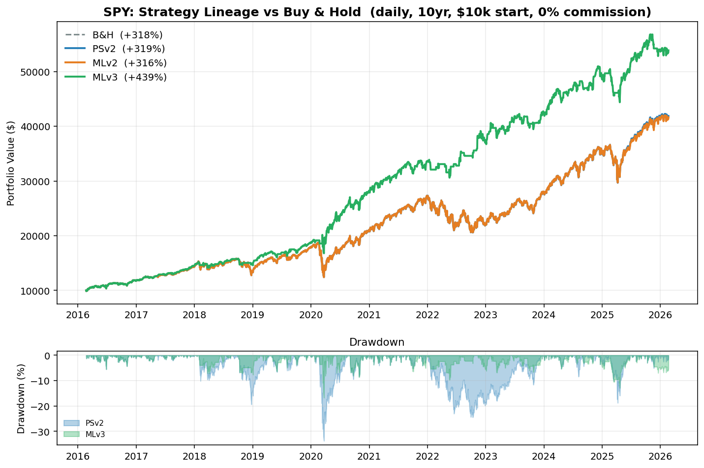
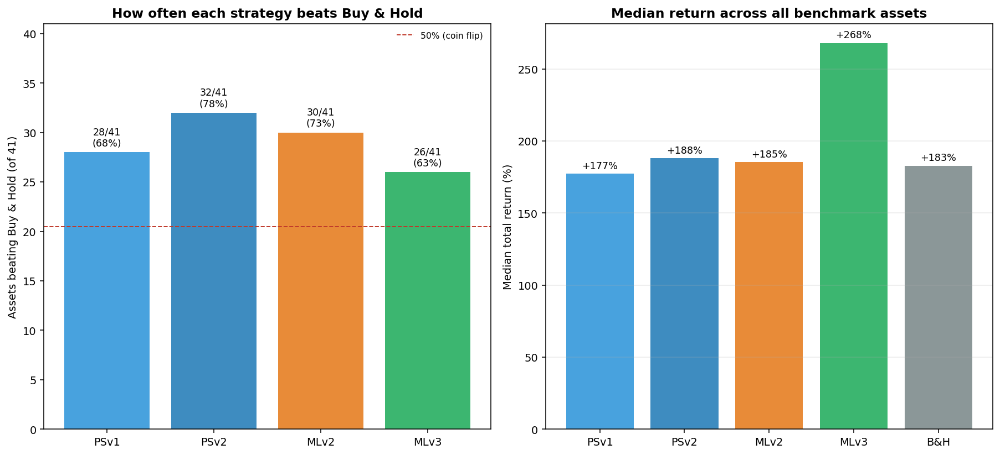
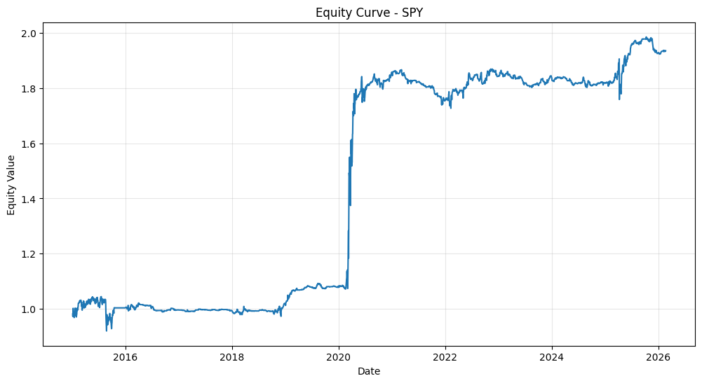

# Adaptive Regime-Based Trading Bot

**🏆 1st place — Lancaster University Quant Hackathon (LEFS × FemTech, Feb 2026)**

A long-only trading-strategy research project that grows a single idea — *shave the peaks instead of avoiding crashes* — from hand-written rules into an XGBoost / Random-Forest ensemble and a competition-winning submission. Backtested across **41 assets** and **~10 years** of market data under one unified backtester with continuous 0–100% position sizing.

> **The one idea.** Without leverage you can't beat Buy & Hold by sitting in cash — every day out of the market is compounding drag. So instead of *avoiding crashes*, **shave the peaks**: stay ~100% invested by default and trim only at statistically stretched, overbought extremes that tend to mean-revert.



---

## Headline results

41 assets across 8 categories (Index, Stock, Sector, Global, Commodity, Crypto, Bond, Forex) · $10,000 start · 0% commission · long-only, no leverage.



| Strategy | Type | Beats B&H — daily (10y) | Beats B&H — hourly (2y) | Median return (daily) |
|:---------|:-----|:-----------------------:|:-----------------------:|:---------------------:|
| Peak Shaver v1 | Rule-based | 28/41 (68%) | 24/41 (59%) | +177% |
| **Peak Shaver v2** | Rule-based | **32/41 (78%)** | 20/41 (49%) | +188% |
| ML Peak Shaver v2 | XGB + RF | 30/41 (73%) | 19/41 (46%) | +185% |
| **ML v3 Return Maximizer** | XGB + RF | 26/41 (63%) | **30/41 (73%)** | **+268%** |
| Buy & Hold | — | — | — | +183% |

Two complementary winners: **Peak Shaver v2 is the most _consistent_** (beats Buy & Hold 78% of the time on daily data), while **ML v3 is the highest _returning_** (best median return, and the single best strategy on 25 of 41 assets). Full per-asset breakdown: [`DAILY.md`](test_data/BACKTEST_RESULTS/DAILY.md) · [`HOURLY.md`](test_data/BACKTEST_RESULTS/HOURLY.md).

---

## Core insight

Traditional active strategies are binary — 100% invested or 100% cash. In a 10-year bull market, every day in cash compounds against you, and missing the 10 best days roughly halves total returns — and the best days cluster right after the worst, so exiting during a crash forfeits the recovery.

So we don't try to avoid crashes. We **shave peaks**: stay 100% invested by default, trim exposure only when multiple overbought signals fire at once, and snap back to full exposure fast. Full reasoning and a worked example in **[HOW_IT_WORKS.md](HOW_IT_WORKS.md)**.

---

## The strategies

The repo captures the idea evolving from hand-written rules to a learned model:

| Code | Where | Approach |
|:-----|:------|:---------|
| **PSv1** | `trading_bot.py` | RSI(14)>75 + ROC(21)>11% → trim to 50%; RSI>85 → 30% |
| **PSv2** | `trading_bot.py` | PSv1 + Z-score(50) tiered gates (>1.0, >3.0); timeframe-adaptive periods |
| **ML v2** | `ml_peak_shaver_v2.py` | XGBRegressor + RandomForest; learns *when a trim is wrong* and overrides it. Multi-horizon labels, magnitude-weighted, dynamic ensemble |
| **ML v3** | `ml_peak_shaver_v3.py` | Every-bar return prediction → position sizing; 37 features, bullish-bias threshold |
| Hackathon Sharpe | `trading_bot.py` | Discrete `{-1, 0, 1}` variant tuned for the competition's Sharpe-ranked, next-day, 5bps eval |

Deep dive on the ML models in **[ML_PS_Explanation.md](ML_PS_Explanation.md)**; discarded approaches and why in **[ADVANCED_TECHNIQUES.md](ADVANCED_TECHNIQUES.md)**. Earlier binary in/out strategies (SMA-200, Dual-MA, Momentum, Crash-Avoidance, Volume-Trend, Ensemble) were dropped from the bot — they beat Buy & Hold on far fewer assets — but remain explorable in the interactive visualizer for comparison.

---

## The hackathon submission

The competition entry loads a pretrained XGBoost + RandomForest ensemble (`model.pkl`, 36 features, trained on 100+ tickers) and is scored by the organizers' `test.py`: **next-day execution, 5 bps transaction costs, ranked by Sharpe ratio.**



| Metric | Value (provided SPY series, 2015–2026) |
|:-------|:--------------------------------------:|
| Sharpe ratio (ranking metric) | **0.61** |
| Total return | +93.5% |
| Max drawdown | −11.9% |
| Signal compute time | 0.12s (limit: 10s) |
| Output validity | 0 NaNs, finite |

Because the contest ranks by **Sharpe**, the submission targets smoother, risk-adjusted returns (shallow −11.9% drawdown) over raw total return. Submission workflow and the eval script are documented in **[HACKATHON_GUIDE.md](HACKATHON_GUIDE.md)**; the entry + harness live in `hackathon_repo/`.

---

## Quick start

```bash
pip install -r requirements.txt
```

**Interactive CLI** — run any strategy on any asset:
```bash
python trading_bot.py
```

**Streamlit terminal dashboard** — Bloomberg/TradingView-style demo:
```bash
streamlit run dashboard.py
```

**Browser visualizer** — scrub through the strategy bar-by-bar (serve from the repo root; opening the file directly won't load the data):
```bash
python -m http.server 8000
# then open http://localhost:8000/viz/index.html
```

**Reproduce all results + the charts above** (trains the ML models, ~3–5 min):
```bash
python run_full_backtest.py     # writes test_data/BACKTEST_RESULTS/{DAILY,HOURLY}.md + both PNGs
```

**Run the hackathon evaluation:**
```bash
cd hackathon_repo && python test.py
```

---

## Project structure

```
trading_bot.py              # Core: indicators, Peak Shaver v1/v2, Hackathon Sharpe, backtester, CLI
ml_peak_shaver_v2.py        # ML strategy v2 — XGB + RF, multi-horizon labels
ml_peak_shaver_v3.py        # ML strategy v3 — every-bar return prediction
dashboard.py                # Streamlit terminal-style demo
run_full_backtest.py        # Regenerates the results tables + both README charts
download_extra_tickers.py   # Fetches extra tickers used only as ML training data
backtest_results.png        # Chart: SPY strategy lineage vs Buy & Hold
cross_asset_results.png     # Chart: 41-asset beat-rate + median return comparison
viz/                        # Interactive browser visualizer (lightweight-charts + vanilla JS)

HOW_IT_WORKS.md             # Rule-based Peak Shaver: the insight, logic, worked example
ML_PS_Explanation.md        # ML v2/v3 deep dive: features, training, walk-forward
HACKATHON_GUIDE.md          # Competition format, eval script, submission workflow
ADVANCED_TECHNIQUES.md      # Discarded approaches and why

test_data/
  daily/                    # ~10y daily OHLCV (41 benchmark assets + extra training tickers)
  hourly/                   # ~2y hourly OHLCV (same tickers)
  BACKTEST_RESULTS/         # DAILY.md + HOURLY.md per-asset results tables

hackathon_repo/             # Competition entry + organizer eval harness
  submissions/strategy.py + model.pkl   # the actual submission
  test.py                   # organizer scoring script
  train_model.py, validate.py, tune.py  # training + local dev tooling
hackathon_ref/              # Untouched copy of the organizer's original 3 files
```

## Data

`test_data/daily` and `test_data/hourly` hold **41 curated benchmark assets** used for every backtest, plus **~68 extra tickers downloaded only as ML training data** (`download_extra_tickers.py`). Backtests deliberately restrict themselves to the 41 named benchmarks, so results stay reproducible regardless of the extra files. Source: Yahoo Finance via `yfinance`. ML models are seeded (`random_state=42`), so `run_full_backtest.py` reproduces the tables and charts above run-to-run.

## Tech stack

`Python 3.10+` · `pandas` · `numpy` · `yfinance` · `xgboost` · `scikit-learn` · `matplotlib` · `streamlit` · `plotly` · `lightweight-charts` (browser viz)

## License

MIT — see [LICENSE](LICENSE). These are historical backtests for research and education, **not investment advice**; past performance does not predict future results.
